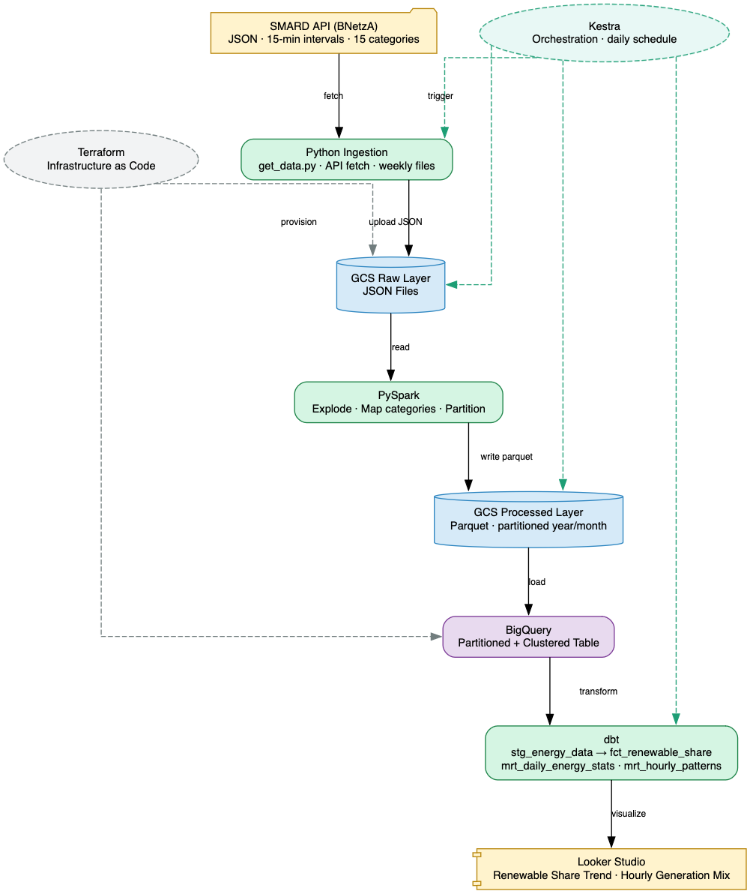
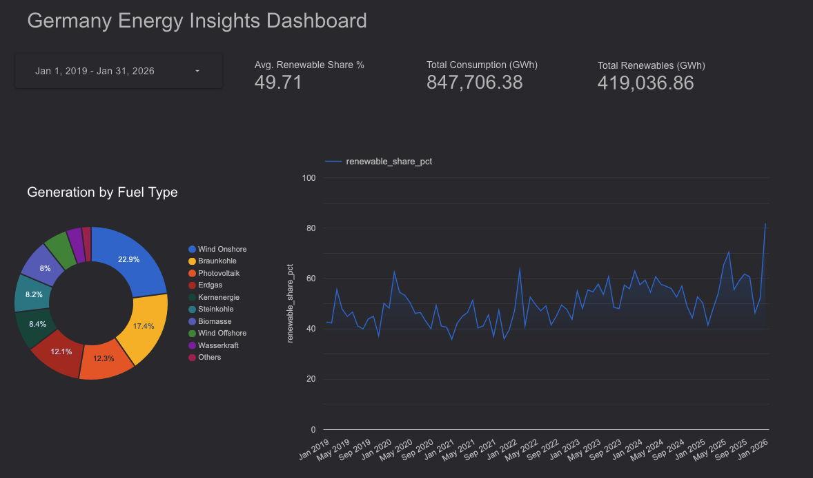
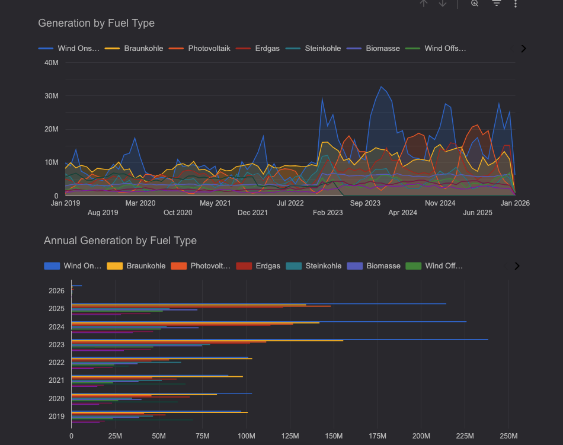
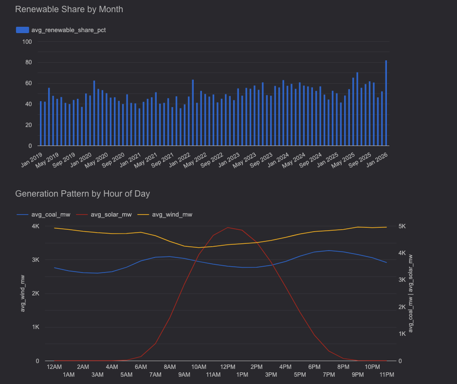

# Germany Energy Insights Dashboard — End-to-End Pipeline

An end-to-end batch data pipeline that ingests, processes, and visualizes Germany's electricity generation data from the SMARD API (Bundesnetzagentur), covering 15 energy sources at 15-minute resolution for 2023–2025.

## Problem Statement

Germany's energy transition (*Energiewende*) is one of the most ambitious in the world, yet making sense of the raw generation data — across wind, solar, coal, gas, nuclear and more — requires significant processing effort. This project answers the question:

> **How is Germany's electricity mix evolving, and what share of demand is covered by renewables at any given time?**

The pipeline automates the full journey from raw API data to an interactive dashboard showing renewable share trends, generation mix, and hourly consumption patterns.

---

## Architecture

```
SMARD API
   │
   ▼
Python Ingestion Script
   │  (JSON → GCS Raw Bucket)
   ▼
Apache Spark (PySpark)
   │  (JSON → Parquet, partitioned by year/month)
   ▼
GCS Processed Bucket
   │
   ▼
BigQuery (partitioned + clustered)
   │
   ▼
dbt (Staging → Facts → Marts)
   │
   ▼
Looker Studio Dashboard
```

All cloud infrastructure is provisioned with **Terraform**.



---

## Technologies

| Layer | Tool |
|---|---|
| Cloud | Google Cloud Platform (GCP) |
| Infrastructure as Code | Terraform |
| Data Lake | Google Cloud Storage (GCS) |
| Batch Processing | Apache Spark (PySpark) |
| Data Warehouse | Google BigQuery |
| Transformations | dbt (data build tool) |
| Workflow Orchestration | Kestra ⏳ |
| Dashboard | Looker Studio |

---

## Dataset

**Source:** [SMARD — Strommarktdaten (Bundesnetzagentur)](https://www.smard.de/)

- **Resolution:** 15-minute intervals
- **Region:** DE-LU (Germany + Luxembourg)
- **Period:** 2023–2025
- **15 energy categories tracked:**

| Category | Type |
|---|---|
| Wind Onshore | Renewable |
| Wind Offshore | Renewable |
| Photovoltaik (Solar) | Renewable |
| Biomasse | Renewable |
| Wasserkraft (Hydro) | Renewable |
| Sonstige Erneuerbare | Renewable |
| Braunkohle (Lignite) | Fossil |
| Steinkohle (Hard Coal) | Fossil |
| Erdgas (Gas) | Fossil |
| Kernenergie (Nuclear) | Conventional |
| Pumpspeicher (Pumped Storage) | Storage |
| Sonstige Konventionelle | Conventional |
| Gesamt / Netzlast (Total Load) | Consumption |
| Residuallast (Residual Load) | Consumption |

---

## Pipeline Details

### 1. Ingestion (`ingestion/get_data.py`)

A Python script queries the SMARD API in two steps:
1. Fetch the timestamp index for each filter/category
2. Download each weekly JSON file and save it locally

### 2. Spark Transformation (`spark/transform_smard.py`)

PySpark reads all raw JSON files, explodes the nested `series` array (one row per 15-minute interval), maps `filter_id` to human-readable `category` names, and writes the result as **Parquet partitioned by `year` and `month`**.

### 3. BigQuery

The processed Parquet files are loaded into BigQuery as a native table:
- **Partitioned** by `TIMESTAMP_TRUNC(timeseries, MONTH)` — eliminates full-table scans for time-range queries
- **Clustered** by `category` — dramatically reduces bytes read when filtering by energy type (e.g., "show me only solar data")

### 4. dbt Transformations (`smard_analytics/`)

A layered dbt project with four models:

```
smard_partitioned (BigQuery source)
       │
       ▼
stg_energy_data        ← view: renames columns, extracts date/hour
       │
       ▼
fct_renewable_share    ← table: PIVOTs all 15 categories into columns,
       │                         computes total_renewables, total_fossils,
       │                         and renewable_share_pct
       ├──► mrt_daily_energy_stats   ← table: daily avg renewable share + day_type label
       └──► mrt_hourly_patterns      ← table: avg solar, wind, coal, load by hour-of-day
```

---

## Dashboard

Built in **Looker Studio**, the dashboard contains two tiles:

1. **Renewable Share Over Time** — daily `renewable_share_pct` trend line showing Germany's progress toward clean energy (temporal distribution)
2. **Generation Mix by Hour** — bar/line chart of average solar, wind, coal and total load by hour of day (categorical distribution)

**[View Live Dashboard](https://datastudio.google.com/reporting/6b7675eb-10f5-47d8-973c-548781d10a82)**

### Overview


### Fuel Trends


### Patterns & Seasonality


---

## Infrastructure (Terraform)

Terraform provisions all GCP resources:

```hcl
google_storage_bucket  "raw_data"          # mastr-pipeline-de-raw-data
google_storage_bucket  "processed-data"    # mastr-pipeline-de-processed-data
google_bigquery_dataset "smard_dataset"    # smard_data
```

---

## Reproducibility

### Prerequisites

- Python 3.10+
- Java 11+ (for Spark)
- GCP project with a service account key (`credentials.json`)
- Terraform CLI
- dbt CLI (`pip install dbt-bigquery`)

### Setup

**1. Clone the repo and install dependencies**

```bash
git clone https://github.com/saifel96/germany-energy-insights.git
cd germany-energy-insights
python -m venv .venv && source .venv/bin/activate
pip install -r requirements.txt
```

**2. Configure environment variables**

Copy `.env.example` to `.env` and fill in your values:

```bash
cp .env.example .env
# Set GCP_PROJECT, GCP_REGION, GOOGLE_APPLICATION_CREDENTIALS
```

**3. Provision infrastructure with Terraform**

```bash
cd terraform
terraform init
terraform apply -var="project=<your-gcp-project-id>"
```

**4. Ingest raw data**

```bash
cd ingestion
python get_data.py
```

Files are saved to `data/` locally.

**5. Run Spark transformation**

```bash
cd spark
spark-submit transform_smard.py
```

Processed Parquet files are written to `data/processed/`.

**6. Upload to GCS**

```bash
python spark/upload_processed_data_to_gcs.py
```

**7. Load into BigQuery**

Create the external table pointing to your GCS processed bucket, then run the DDL to create the partitioned + clustered native table (see `smard_analytics/models/source.yaml` for schema reference).

**8. Run dbt**

```bash
cd smard_analytics
dbt deps
dbt run
dbt test
```

**9. Connect Looker Studio**

Create a new Looker Studio report, connect to BigQuery, and use the `mrt_daily_energy_stats` and `mrt_hourly_patterns` tables as data sources.

---

## Project Structure

```
germany-energy-insights/
├── ingestion/
│   └── get_data.py              # SMARD API ingestion script
├── spark/
│   ├── transform_smard.py       # PySpark transformation
│   └── upload_processed_data_to_gcs.py
├── smard_analytics/             # dbt project
│   ├── models/
│   │   ├── source.yaml
│   │   ├── stg_energy_data.sql
│   │   ├── fct_renewable_share.sql
│   │   ├── mrt_daily_energy_stats.sql
│   │   └── mrt_hourly_patterns.sql
│   └── dbt_project.yml
├── terraform/
│   ├── main.tf
│   └── variables.tf
├── kestra/
│   └── mastr_dag.py             # Orchestration DAG
├── data/                        # Raw JSON files (gitignored)
└── docker-compose.yml
```

---

## Orchestration Strategy

A hybrid approach was used to ensure delivery despite JVM/macOS compatibility constraints:

| Task | Method | Notes |
| :--- | :--- | :--- |
| 1. Ingestion | Kestra (automated) | SMARD API fetch via Python |
| 2. Raw Upload to GCS | Kestra (automated) | JSON → GCS Raw bucket |
| 3. Spark Processing | Manual (local PySpark) | JVM 17+ / ARM conflict bypassed locally |
| 4. Processed Upload to GCS | Kestra (automated) | Parquet → GCS Processed bucket |
| 5. BigQuery External Table | Manual (BigQuery SQL) | Hive-partition alignment for 2019–2026 data |
| 6. dbt Transformations | Kestra (automated) | Final modeling and business logic |

---

## Engineering Challenges

### JVM Compatibility (PySpark on ARM/Java 21+)
Kestra's container ran Java 25, which completely removed `SecurityManager` — a dependency of Hadoop's `UserGroupInformation.getCurrentUser()` used by PySpark. No JVM flag can restore this in Java 21+. The workaround was running the Spark transformation locally with Java 17, then uploading the resulting Parquet files to GCS.

### Historical Data Integrity (2019–2026)
The BigQuery External Table required a metadata refresh to discover older Hive partitions already present in GCS. A `dbt run --full-refresh` then forced a full rebuild of all incremental models, ensuring the `fct_renewable_share` table covers the complete 2019–2026 range.

---

## Final Results

- **Data volume:** 245,000+ rows of 15-minute energy generation data
- **Time range:** January 2019 – April 2026
- **Key insight:** Average renewable share of ~49.7%, consistent with official *Energiewende* benchmarks